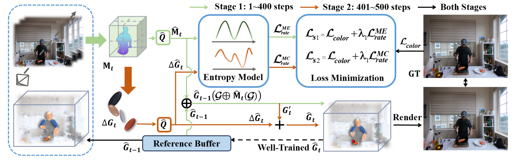

# <center> 4DGC: Rate-Aware 4D Gaussian Compression for Efficient Streamable Free-Viewpoint Video </center>

<p>
<div style="text-align: center;">
<a href="https://qianghu-huber.github.io/qianghuhomepage/">Qiang Hu</a><sup>*</sup>,
<a href="https://zihanzheng-sjtu.github.io/">Zihan Zheng</a><sup>*</sup>, Houqiang Zhong, Sihua Fu, Li Song, 
Xiaoyun Zhang<sup>&dagger;</sup>, Guangtao Zhai, 
Yanfeng Wang<sup>&dagger;</sup>
</div>
</p>

<p>
<div style="text-align: center;">
<a href="https://openaccess.thecvf.com/content/CVPR2025/html/Hu_4DGC_Rate-Aware_4D_Gaussian_Compression_for_Efficient_Streamable_Free-Viewpoint_Video_CVPR_2025_paper.html">[CVPR]</a>,
<a href="https://arxiv.org/abs/2503.18421v1">[arXiv]</a>
</div>
</p>


## Experiment
1. Prepare the Enveriment:

    Firstly, follow the instructions in <a href="https://github.com/graphdeco-inria/gaussian-splatting/tree/main">gaussian-splatting</a> to setup the environment and submodules. After that, you should install several additional packages:
    ```
    pip install compressai
    pip install range-coder
    ```

2. Prepare the Multi-view Video Dataset:
    
    Follow [3DGStream]("https://github.com/SJoJoK/3DGStream") to get the dataset folder like this:
    ```
    dataset/coffee_martini
    |---colmap_0
    |   |---sparse
    |   |---images
    |      |---cam00.png
    |      |---cam01.png
    |      |---...
    |---colmap_1
    |---...
    |---colmap_299
    ```
3. Get the initial 3DGS:

    Run
    ```
    python train_initial.py -s dataset/coffee_martini/colmap_0 -o outputs/coffee_martini -m outputs/coffee_martini_initial --eval (-r 2)
    ```
    to get the compressed initial 3DGS. Then, copy the checkpoint `outputs/coffee_martini_initial` to the folder `test`, copy `test/cfg_args.json` into the checkpoint folder and modify the parameters therein accordingly.
4. Warm up the MEM:

    Following [3DGStream]("https://github.com/SJoJoK/3DGStream"), we also designed the MEM warm up. Just run
    ```
    cd scripts
    python Motion_Grid_warmup.py --pcd_pth <test/xxx/point_cloud/iteration_xxx/point_cloud.ply> --q <quantization step size> --output_path <mem/xxx.pth>
    ``` 
5. Train the full 4DGC:

    Everything is set up, just run

    ```
    python train_frames.py --read_config --config_path <test/xxx/cfg_args.json> -o <outputs/xxx> -m <test/xxx> -v <dataset/xxx> --image images 
    ```

## Acknowledgement
We sincerely thank the  foundational work of [3DGStream]("https://github.com/SJoJoK/3DGStream"), [3DGS]("https://github.com/graphdeco-inria/gaussian-splatting/tree/main") and [Compressai]("https://github.com/InterDigitalInc/CompressAI"), which form the basis of the 4DGC code.

## Citation

```
@InProceedings{Hu_2025_CVPR,
    author    = {Hu, Qiang and Zheng, Zihan and Zhong, Houqiang and Fu, Sihua and Song, Li and Zhang, Xiaoyun and Zhai, Guangtao and Wang, Yanfeng},
    title     = {4DGC: Rate-Aware 4D Gaussian Compression for Efficient Streamable Free-Viewpoint Video},
    booktitle = {Proceedings of the Computer Vision and Pattern Recognition Conference (CVPR)},
    month     = {June},
    year      = {2025},
    pages     = {875-885}
}
```